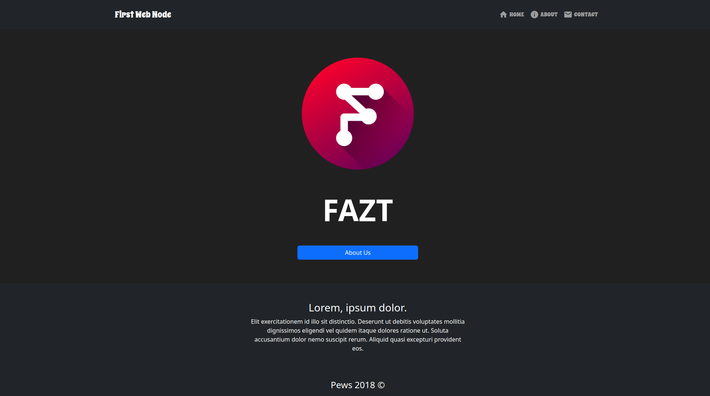

# Screenshot


### Installation

clone the repo

```
git clone https://github.com/FaztWeb/first-node-express-app
```

move to the folder

```
cd first-node-express-app
```

install dependencies:

```
npm install
```

execute the project

```
npm run dev
```


# Your First Nodejs/Express Website
This is the repository of a very simple nodejs real project
The goal of this code, is that you understand all the code
and the reason Why I choose certain modules.

# You will learn
- How to start a nodejs project
- How to create routes for your server application
- How to use a template engine like ejs, handlebars, pug, etc.
- Call Assets from CDNs and use static files
- Divide content using partials feature from Template engines
- Deploy our app using a simple service called Now(A service from Zeit Company)

# Issues
For any problem that you find, open an issue here on github or if
native language is Spanish join us on [Discord](https://discord.gg/37PHuNw)
